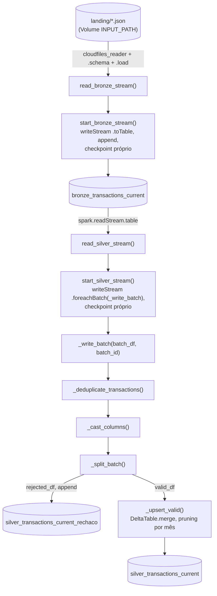

# Funções do pipeline imperativo (`imperativo/autoloader/`) — fluxo e referência

Este documento descreve, na ordem em que os dados fluem pela pipeline (landing → bronze →
silver válida/rejeitada), cada função definida no código deste pipeline, com o snippet
correspondente. Para o histórico de como cada peça chegou a esse formato, ver
`imperativo/autoloader/changelog.md`; para a motivação detalhada do `foreachBatch` usado na
silver, ver `imperativo/FOREACHBATCH.md`.

> **Diferença em relação a `declarativa/FUNCOES.md`:** aqui não há framework decidindo a ordem —
> são duas **streaming queries independentes** (`start_bronze_stream()`/`start_silver_stream()`),
> cada uma com seu próprio `checkpointLocation` e `trigger(availableNow=True)`, encadeadas só
> porque a silver lê a tabela Delta que a bronze escreve. A ordem abaixo é a ordem real de
> execução quando cada módulo roda como `__main__`, não uma reconstrução de linhagem.

## Fluxo completo

```
landing (arquivos JSON, Volume INPUT_PATH)
    │
    │  cloudfiles_reader(spark.readStream) . schema(SCHEMA) . load(INPUT_PATH)      [Auto Loader]
    ▼
read_bronze_stream()
    │  explode_outer("data") + select/alias das colunas de negócio
    │  transaction_conversion_date já vem DATE (.cast("date") no select)
    │  + transaction_conversion_month (STRING, formato "yyyy-MM")
    ▼
start_bronze_stream()                                    [streaming query #1 — bronze]
    │  create_bronze_checkpoints_volume() + create_bronze_table()
    │  .writeStream .format("delta") .outputMode("append")
    │  .option("checkpointLocation", BRONZE_CHECKPOINT_PATH)
    │  .trigger(availableNow=True) . toTable(BRONZE_TABLE)
    ▼
[tabela Delta] bronze_transactions_current
    │
    │  read_silver_stream(): spark.readStream.table(BRONZE_TABLE)
    ▼
start_silver_stream()                                    [streaming query #2 — silver, independente da #1]
    │  create_silver_checkpoints_volume() + create_silver_table() + create_silver_rejected_table()
    │  .writeStream .foreachBatch(_write_batch)
    │  .option("checkpointLocation", SILVER_CHECKPOINT_PATH)
    │  .trigger(availableNow=True) . start()
    │
    │  a cada micro-batch, o Structured Streaming chama _write_batch(batch_df, batch_id):
    ▼
_deduplicate_transactions(batch_df)  Window/row_number por TRANSACTION_BUSINESS_KEY, DEDUP_ORDER desc
    ▼                                (roda ANTES do cast — dedup só usa business key + DEDUP_ORDER)
_cast_columns(deduped_df)            tipagem de negócio (DECIMAL(20,2) nos 8 campos monetários/quantidade)
    ▼
_split_batch(casted_df)              (valid_df, rejected_df) via EXPECTATIONS
    │
    ├── rejected_df ──► .write.format("delta").mode("append") ──► [tabela] silver_transactions_current_rechaco
    │
    └── valid_df ────► _upsert_valid(valid_df) ──► DeltaTable.merge(...) ──► [tabela] silver_transactions_current
```



## Índice

**Camada bronze** (`imperativo/autoloader/bronze/`, `common/`)
1. [`get_spark`](#1-get_spark) — `common/spark.py`
2. [`cloudfiles_reader`](#2-cloudfiles_reader) — `common/config.py`
3. [`create_bronze_schema`](#3-create_bronze_schema) — `bronze/tables_bronze_config.py`
4. [`create_bronze_checkpoints_volume`](#4-create_bronze_checkpoints_volume) — `bronze/tables_bronze_config.py`
5. [`transactions_current_schema`](#5-transactions_current_schema) — `bronze/tables_bronze_config.py`
6. [`create_bronze_table`](#6-create_bronze_table) — `bronze/tables_bronze_config.py`
7. [`read_bronze_stream`](#7-read_bronze_stream) — `bronze/bronze_transactions_current.py`
8. [`start_bronze_stream`](#8-start_bronze_stream) — `bronze/bronze_transactions_current.py`

**Camada silver** (`imperativo/autoloader/silver/`)
9. [`create_silver_schema`](#9-create_silver_schema) — `silver/tables_silver_config.py`
10. [`create_silver_checkpoints_volume`](#10-create_silver_checkpoints_volume) — `silver/tables_silver_config.py`
11. [`create_silver_table`](#11-create_silver_table) — `silver/tables_silver_config.py`
12. [`create_silver_rejected_table`](#12-create_silver_rejected_table) — `silver/tables_silver_config.py`
13. [Constantes de negócio (`EXPECTATIONS`, `TRANSACTION_BUSINESS_KEY`, `DEDUP_ORDER`, `REJECTED_PAYLOAD_EXCLUDED_COLUMNS`)](#13-constantes-de-negócio) — `silver/tables_silver_config.py`
14. [`read_silver_stream`](#14-read_silver_stream) — `silver/silver_transactions_current.py`
15. [`_cast_columns`](#15-_cast_columns) — `silver/silver_transactions_current.py`
16. [`_deduplicate_transactions`](#16-_deduplicate_transactions) — `silver/silver_transactions_current.py`
17. [`_split_batch`](#17-_split_batch) — `silver/silver_transactions_current.py`
18. [`_upsert_valid`](#18-_upsert_valid) — `silver/silver_transactions_current.py`
19. [`_write_batch`](#19-_write_batch) — `silver/silver_transactions_current.py` (orquestra 15-18)
20. [`start_silver_stream`](#20-start_silver_stream) — `silver/silver_transactions_current.py` (orquestra 9-14, inicia o stream)

---

# Camada bronze

## 1. `get_spark`

**Onde:** `imperativo/autoloader/common/spark.py`. **Chamada por:** o próprio módulo, na última
linha (`spark = get_spark()`) — todo o resto do pipeline importa `spark` já pronto
(`from common.spark import spark`), não chama `get_spark()` diretamente.

```python
from pyspark.sql import SparkSession


def get_spark() -> SparkSession:
    spark = SparkSession.getActiveSession()

    if spark is None:
        spark = (
            SparkSession.builder
            .appName("POC OpenFinance")
            .config("spark.sql.adaptive.enabled", "true")
            .config("spark.databricks.delta.merge.enableLowShuffle", "true")
            .getOrCreate()
        )

    return spark


spark = get_spark()
```

O que faz: retorna a `SparkSession` ativa (o caso normal ao rodar como notebook/job Databricks,
onde o cluster já injeta uma sessão) ou cria uma nova com `appName("POC OpenFinance")` se não
houver nenhuma (fallback para execução fora do Databricks, ex. testes locais). No branch de
criação, o builder ganhou `spark.sql.adaptive.enabled` (AQE) e
`spark.databricks.delta.merge.enableLowShuffle` — otimizações pensadas para o `MERGE` da silver
(item 21, Tarefa 8, do changelog). **Ressalva importante:** esse branch só executa quando **não**
existe sessão ativa; em notebook/job Databricks normal a sessão já vem ativa do runtime, então
essas duas configs provavelmente nunca chegam a ser aplicadas na prática neste ambiente — não
confirmado se `enableLowShuffle` de fato está ativo durante o `MERGE` (ver pendências do
changelog). É a única função de `common/spark.py`, e o módulo já expõe o resultado pronto
(`spark`) para o resto do pipeline usar como singleton.

---

## 2. `cloudfiles_reader`

**Onde:** `imperativo/autoloader/common/config.py`. **Chamada por:** `read_bronze_stream` (item
7) — única função compartilhada entre bronze e silver (a silver não lê arquivos, só a tabela
bronze via `spark.readStream.table(...)`, item 14).

```python
from pyspark.sql.streaming import DataStreamReader

INPUT_PATH = "/Volumes/imperative_open_finance_funds_investiments_transactions_current/bronze/landing"

BRONZE_CHECKPOINT_PATH = "/Volumes/imperative_open_finance_funds_investiments_transactions_current/bronze/checkpoints/bronze_transactions_current_imperative"
SILVER_CHECKPOINT_PATH = "/Volumes/imperative_open_finance_funds_investiments_transactions_current/silver/checkpoints/silver_transactions_current_imperative"

BRONZE_TABLE = "imperative_open_finance_funds_investiments_transactions_current.bronze.bronze_transactions_current"
SILVER_TABLE = "imperative_open_finance_funds_investiments_transactions_current.silver.silver_transactions_current"
SILVER_REJECTED_TABLE = "imperative_open_finance_funds_investiments_transactions_current.silver.silver_transactions_current_rechaco"

CLOUDFILES_OPTIONS = {
    "cloudFiles.format": "json",
    "cloudFiles.includeExistingFiles": "true",
    "cloudFiles.schemaEvolutionMode": "rescue",
    "cloudFiles.schemaLocation": BRONZE_CHECKPOINT_PATH,
    "cloudFiles.allowOverwrites": "true",
    "cloudFiles.maxFilesPerTrigger": "1000",
    "cloudFiles.maxBytesPerTrigger": "512m",
    "pathGlobFilter": "*.json",
    "multiline": "true",
}

def cloudfiles_reader(reader: DataStreamReader) -> DataStreamReader:
    reader = reader.format("cloudFiles")

    for option, value in CLOUDFILES_OPTIONS.items():
        reader = reader.option(option, value)

    return reader
```

O que faz: mesmo papel que a versão declarativa (`declarativa/FUNCOES.md`, item 1) — recebe um
`DataStreamReader` e devolve configurado para Auto Loader (`.format("cloudFiles")` + todas as
opções de `CLOUDFILES_OPTIONS`, em loop). Opções que não existem na versão declarativa:
`cloudFiles.schemaLocation: BRONZE_CHECKPOINT_PATH` (setado explicitamente — reaproveita o mesmo
path do checkpoint da streaming query, já que ambos são "estado que o Auto Loader precisa
persistir entre execuções"), `cloudFiles.maxFilesPerTrigger: "1000"` (limita quantos arquivos
cada micro-batch processa) e `cloudFiles.maxBytesPerTrigger: "512m"` (limite de volume em bytes
por trigger, adicionado no item 21/Tarefa 7 do changelog — o Auto Loader respeita o primeiro dos
dois limites que for atingido). `BRONZE_CHECKPOINT_PATH`/`SILVER_CHECKPOINT_PATH` explícitos aqui
são o ponto que não existe no framework declarativo — ver `declarativa/AUTO_CDC_FLOW.md`, item 6.

---

## 3. `create_bronze_schema`

**Onde:** `imperativo/autoloader/bronze/tables_bronze_config.py`. **Chamada por:**
`bronze_transactions_current.py`, no nível de módulo — primeira coisa que executa ao importar o
módulo, antes até de montar `SCHEMA`.

```python
from common.config import BRONZE_CHECKPOINT_PATH, BRONZE_TABLE
from common.spark import spark

BRONZE_SCHEMA = ".".join(BRONZE_TABLE.split(".")[:2])


def create_bronze_schema() -> None:
    spark.sql(f"CREATE SCHEMA IF NOT EXISTS {BRONZE_SCHEMA}")
```

O que faz: `BRONZE_SCHEMA` deriva `catalog.schema` a partir de `BRONZE_TABLE`
(`catalog.schema.table`), pegando só os dois primeiros segmentos via `split(".")[:2]`. A função
roda um `CREATE SCHEMA IF NOT EXISTS` puro SQL — garante que o schema Unity Catalog existe antes
de qualquer `CREATE TABLE`/escrita, já que (diferente da declarativa) nada aqui é provisionado
automaticamente pelo framework.

---

## 4. `create_bronze_checkpoints_volume`

**Onde:** mesmo arquivo do item 3. **Chamada por:** `start_bronze_stream` (item 8), antes de
iniciar a streaming query.

```python
BRONZE_CHECKPOINTS_VOLUME = ".".join(BRONZE_CHECKPOINT_PATH.strip("/").split("/")[1:4])


def create_bronze_checkpoints_volume() -> None:
    spark.sql(f"CREATE VOLUME IF NOT EXISTS {BRONZE_CHECKPOINTS_VOLUME}")
```

O que faz: deriva o nome do Volume (`catalog.schema.volume`) a partir de
`BRONZE_CHECKPOINT_PATH` (um path `/Volumes/<catalog>/<schema>/<volume>/...`), pegando os
segmentos `[1:4]` depois de remover as barras nas pontas. Executa `CREATE VOLUME IF NOT EXISTS` —
garante que o Volume onde o checkpoint (e o `cloudFiles.schemaLocation`, item 2) vai ser gravado
existe antes do Auto Loader tentar escrever nele.

---

## 5. `transactions_current_schema`

**Onde:** mesmo arquivo. **Chamada por:** `bronze_transactions_current.py`, no nível de módulo
(`SCHEMA = transactions_current_schema()`).

```python
from pyspark.sql.types import (
    ArrayType,
    StringType,
    StructField,
    StructType,
)

def transactions_current_schema():
    monetary_type = StructType([
        StructField("amount", StringType(), True),
        StructField("currency", StringType(), True)
    ])

    transaction_schema = StructType([
        StructField("clientId", StringType(), False),
        StructField("investimentId", StringType(), False),
        StructField("transactionId", StringType(), False),
        StructField("type", StringType(), True),
        StructField("transactionType", StringType(), True),
        StructField("transactionTypeAdditionalInfo", StringType(), True),
        StructField("transactionConversionDate", StringType(), True),
        StructField("transactionQuotaPrice", monetary_type, True),
        StructField("transactionQuotaQuantity", StringType(), True),
        StructField("transactionValue", monetary_type, True),
        StructField("transactionGrossValue", monetary_type, True),
        StructField("incomeTax", monetary_type, True),
        StructField("financialTransactionTax", monetary_type, True),
        StructField("transactionExitFee", monetary_type, True),
        StructField("transactionNetValue", monetary_type, True)
    ])

    meta_schema = StructType([
        StructField("requestDateTime", StringType(), True)
    ])

    return StructType([
        StructField("data", ArrayType(transaction_schema), True),
        StructField("meta", meta_schema, True)
    ])
```

O que faz: idêntica, campo a campo, à versão declarativa (`declarativa/FUNCOES.md`, item 2) — os
dois pipelines compartilham o mesmo formato de payload de origem, só duplicado em vez de
importado de um lugar comum (pipelines vivem em módulos/deployments separados). Todos os campos
do payload bruto continuam `StringType` aqui — a tipagem de negócio acontece depois, no `select`
de `read_bronze_stream` (item 7), não neste `StructType`. Retorna o schema passado ao Auto Loader
via `.schema(SCHEMA)`.

---

## 6. `create_bronze_table`

**Onde:** mesmo arquivo. **Chamada por:** `start_bronze_stream` (item 8).

```python
def create_bronze_table() -> None:
    spark.sql(f"""
        CREATE TABLE IF NOT EXISTS {BRONZE_TABLE} (
            client_id                          STRING,
            investiment_id                     STRING,
            transaction_id                     STRING,
            type                                STRING,
            transaction_type                   STRING,
            transaction_type_additional_info   STRING,
            transaction_conversion_date        DATE,
            transaction_quota_price_amount     STRING,
            transaction_quota_price_currency   STRING,
            transaction_quota_quantity         STRING,
            transaction_value_amount           STRING,
            transaction_value_currency         STRING,
            transaction_gross_value_amount     STRING,
            transaction_gross_value_currency   STRING,
            income_tax_amount                  STRING,
            income_tax_currency                STRING,
            financial_transaction_tax_amount   STRING,
            financial_transaction_tax_currency STRING,
            transaction_exit_fee_amount        STRING,
            transaction_exit_fee_currency      STRING,
            transaction_net_value_amount       STRING,
            transaction_net_value_currency     STRING,
            source_file                        STRING,
            ingestion_ts                       TIMESTAMP,
            ingestion_date                     DATE,
            _rescued_data                      STRING,
            transaction_conversion_month       STRING
        )
        USING DELTA
        CLUSTER BY (transaction_conversion_month, client_id)
        COMMENT 'Bronze layer - Fundos de Investimentos - Transactions Current'
        TBLPROPERTIES (
            'quality' = 'bronze',
            'delta.autoOptimize.optimizeWrite' = 'true',
            'delta.autoOptimize.autoCompact' = 'true'
        )
    """)
```

O que faz: `CREATE TABLE IF NOT EXISTS` explícito (diferente da declarativa, onde `@dp.table(...)`
faz isso implicitamente) — landing quase puro: todas as colunas de negócio continuam `STRING`,
**exceto** `transaction_conversion_date`, que é `DATE` (mudança do item 25 do changelog — deixou
de seguir o padrão "bronze = tudo `STRING`" por pedido explícito, para que datas malformadas já
virem `NULL` de forma controlada na origem em vez de propagar lixo). Colunas técnicas tipadas
(`ingestion_ts TIMESTAMP`, `ingestion_date DATE`), `transaction_conversion_month` como `STRING` no
formato `"yyyy-MM"` (item 20 — reverteu uma tentativa anterior de guardar como `DATE` truncado no
dia 1 do mês). `CLUSTER BY (transaction_conversion_month, client_id)` — trocou de
`(transaction_conversion_month, transaction_id)` (item 19/relatório de performance): `transaction_id`
tem cardinalidade quase 1:1 por linha, sem ganho real de pruning; `client_id` casa melhor com o
padrão de consulta "transações de um cliente num período". `TBLPROPERTIES` ganhou
`delta.autoOptimize.optimizeWrite`/`autoCompact` (item 19) para mitigar o Small Files Problem de
escritas streaming frequentes. `IF NOT EXISTS` faz o `CREATE` ser idempotente — seguro chamar em
toda execução da pipeline, só cria (com este schema) na primeira vez; numa tabela já existente com
schema antigo (`transaction_conversion_date STRING`, por exemplo) o `CREATE` é no-op e a próxima
escrita falharia por incompatibilidade — ver pendências do changelog.

> **Nota:** o guia de otimização (`ignore/PROMPT_OTIMIZACAO_PERFORMANCE.md`) e o item 21 do
> changelog descrevem também `'delta.enableDeletionVectors' = 'true'` como aplicado a este
> `TBLPROPERTIES` — **não está presente no código atual**. Se essa propriedade for necessária,
> confirmar se foi de fato aplicada só via `ALTER TABLE` fora do repositório, ou se precisa ser
> readicionada aqui.

---

## 7. `read_bronze_stream`

**Onde:** `imperativo/autoloader/bronze/bronze_transactions_current.py`. **Chamada por:**
`start_bronze_stream` (item 8).

> O módulo abre com `sys.path.append("/Workspace/Users/<user_email>/imperative_open_finance_funds_investiments_transactions_current/autoloader")`
> antes dos imports "irmãos" (`from common.config import ...`, `from tables_bronze_config import
> ...`) — necessário porque o script roda diretamente de dentro de `bronze/` num Workspace
> Databricks, e esse path é o que dá ao Python acesso ao diretório `common/` (um nível acima).
> `create_bronze_schema()` (item 3) é chamada logo em seguida, no nível de módulo, antes de
> `SCHEMA = transactions_current_schema()`.

```python
def read_bronze_stream() -> DataFrame:
    raw = (
        cloudfiles_reader(spark.readStream)
        .schema(SCHEMA)
        .load(INPUT_PATH)
        .withColumns({
        "source_file": F.col("_metadata.file_path"),
        "ingestion_ts": F.current_timestamp(),
        "ingestion_date": F.to_date("ingestion_ts")
        })
    )

    exploded = raw.select(
        F.explode_outer("data").alias("transaction"),
        "source_file",
        "ingestion_ts",
        "ingestion_date",
        "_rescued_data",
    )

    return exploded.select(
        F.col("transaction.clientId").alias("client_id"),
        F.col("transaction.investimentId").alias("investiment_id"),
        F.col("transaction.transactionId").alias("transaction_id"),
        F.col("transaction.type").alias("type"),
        F.col("transaction.transactionType").alias("transaction_type"),
        F.col("transaction.transactionTypeAdditionalInfo").alias("transaction_type_additional_info"),
        F.col("transaction.transactionConversionDate").cast("date").alias("transaction_conversion_date"),
        F.col("transaction.transactionQuotaPrice.amount").alias("transaction_quota_price_amount"),
        F.col("transaction.transactionQuotaPrice.currency").alias("transaction_quota_price_currency"),
        F.col("transaction.transactionQuotaQuantity").alias("transaction_quota_quantity"),
        F.col("transaction.transactionValue.amount").alias("transaction_value_amount"),
        F.col("transaction.transactionValue.currency").alias("transaction_value_currency"),
        F.col("transaction.transactionGrossValue.amount").alias("transaction_gross_value_amount"),
        F.col("transaction.transactionGrossValue.currency").alias("transaction_gross_value_currency"),
        F.col("transaction.incomeTax.amount").alias("income_tax_amount"),
        F.col("transaction.incomeTax.currency").alias("income_tax_currency"),
        F.col("transaction.financialTransactionTax.amount").alias("financial_transaction_tax_amount"),
        F.col("transaction.financialTransactionTax.currency").alias("financial_transaction_tax_currency"),
        F.col("transaction.transactionExitFee.amount").alias("transaction_exit_fee_amount"),
        F.col("transaction.transactionExitFee.currency").alias("transaction_exit_fee_currency"),
        F.col("transaction.transactionNetValue.amount").alias("transaction_net_value_amount"),
        F.col("transaction.transactionNetValue.currency").alias("transaction_net_value_currency"),
        "source_file",
        "ingestion_ts",
        "ingestion_date",
        "_rescued_data",
        F.date_format(
            F.col("transaction.transactionConversionDate").cast("date"), "yyyy-MM"
        ).alias("transaction_conversion_month"),
    )
```

O que faz, em ordem — equivalente exato de `bronze_transactions_current()` na declarativa
(`declarativa/FUNCOES.md`, item 3), só que devolvendo o `DataFrame` streaming em vez de ser a
própria tabela (aqui quem materializa é `start_bronze_stream`, item 8, separadamente):
1. `cloudfiles_reader(spark.readStream).schema(SCHEMA).load(INPUT_PATH)` — Auto Loader com schema
   explícito.
2. `.withColumns({"source_file": ..., "ingestion_ts": ..., "ingestion_date": ...})` — as 3
   colunas técnicas num único dicionário em vez de 3 `.withColumn(...)` encadeados (item 24 do
   changelog — mesmo padrão de consolidação já aplicado na silver, item 21/Tarefa 4).
3. `exploded = raw.select(F.explode_outer("data").alias("transaction"), ...)` — um `data` por
   transação.
4. `return exploded.select(...)` — extrai cada campo `transaction.<campo>` com alias
   `snake_case`. Duas colunas recebem tratamento especial, ambas derivadas do mesmo campo de
   origem `transactionConversionDate`:
   - `transaction_conversion_date`: ganha `.cast("date")` já aqui na bronze (item 25) — strings
     malformadas viram `NULL` de forma controlada pelo cast implícito, em vez de propagar
     qualquer lixo adiante.
   - `transaction_conversion_month`: `F.date_format(F.col("transaction.transactionConversionDate").cast("date"), "yyyy-MM")`
     — repete o `.cast("date")` inline (em vez de reaproveitar uma variável entre as duas
     expressões, por preferência explícita do usuário registrada no changelog) e formata como
     `STRING "yyyy-MM"`. Esse é o resultado final depois de duas idas e voltas no changelog: o
     item 17 tinha trocado para `DATE` truncado no dia 1; o item 20 reverteu para `STRING`
     `"yyyy-MM"` por pedido explícito; o item 21/Tarefa 5 tentou uma versão mais barata com
     `F.substring(col, 1, 7)` (sem `.cast("date")`, evitando o round-trip), mas isso abriu uma
     falha de SQL injection no `MERGE` da silver (item 22) porque a coluna deixava de ser
     validada como data; o item 25 fechou a história voltando ao `.cast("date")` explícito antes
     do `date_format`, que é o que está no código hoje.

---

## 8. `start_bronze_stream`

**Onde:** mesmo arquivo do item 7. **Chamada por:** o bloco `if __name__ == "__main__":`, ponto
de entrada do módulo quando executado como job/notebook.

```python
def start_bronze_stream() -> StreamingQuery:
    create_bronze_checkpoints_volume()
    create_bronze_table()
    bronze_stream = read_bronze_stream()

    return (
        bronze_stream.writeStream
        .format("delta")
        .outputMode("append")
        .option("checkpointLocation", BRONZE_CHECKPOINT_PATH)
        .trigger(availableNow=True)
        .toTable(BRONZE_TABLE)
    )


if __name__ == "__main__":
    query = start_bronze_stream()
    query.awaitTermination()
```

O que faz: orquestra a camada bronze inteira. `create_bronze_checkpoints_volume()` (item 4) +
`create_bronze_table()` (item 6) garantem a infraestrutura antes de qualquer escrita;
`read_bronze_stream()` (item 7) monta o `DataFrame` streaming (ainda não executado, lazy); o sink
nativo `.writeStream.format("delta").outputMode("append")...toTable(BRONZE_TABLE)` grava
(`imperativo/FOREACHBATCH.md`, §2, explica por que a bronze usa sink nativo em vez de
`foreachBatch`: um destino só, `append` puro, sem lógica por micro-batch).
`.option("checkpointLocation", BRONZE_CHECKPOINT_PATH)` + `.trigger(availableNow=True)` — processa
tudo disponível na fonte e encerra sozinho (não fica rodando indefinidamente). Retorna a
`StreamingQuery`; `query.awaitTermination()` (no `__main__`) bloqueia até ela terminar.

---

# Camada silver

## 9. `create_silver_schema`

**Onde:** `imperativo/autoloader/silver/tables_silver_config.py`. **Chamada por:**
`silver_transactions_current.py`, no nível de módulo — mesmo padrão do item 3, agora pro schema da
silver.

```python
from common.config import SILVER_CHECKPOINT_PATH, SILVER_REJECTED_TABLE, SILVER_TABLE
from common.spark import spark

SILVER_SCHEMA = ".".join(SILVER_TABLE.split(".")[:2])


def create_silver_schema() -> None:
    spark.sql(f"CREATE SCHEMA IF NOT EXISTS {SILVER_SCHEMA}")
```

Mesmo papel do item 3, para o schema `catalog.schema` derivado de `SILVER_TABLE`.

---

## 10. `create_silver_checkpoints_volume`

**Onde:** mesmo arquivo. **Chamada por:** `start_silver_stream` (item 20).

```python
SILVER_CHECKPOINTS_VOLUME = ".".join(SILVER_CHECKPOINT_PATH.strip("/").split("/")[1:4])


def create_silver_checkpoints_volume() -> None:
    spark.sql(f"CREATE VOLUME IF NOT EXISTS {SILVER_CHECKPOINTS_VOLUME}")
```

Mesmo papel do item 4, agora para o Volume de checkpoint da silver
(`SILVER_CHECKPOINT_PATH`) — checkpoint próprio, separado do checkpoint arquivos→bronze (item 2).

---

## 11. `create_silver_table`

**Onde:** mesmo arquivo. **Chamada por:** `start_silver_stream` (item 20).

```python
def create_silver_table() -> None:
    spark.sql(f"""
        CREATE TABLE IF NOT EXISTS {SILVER_TABLE} (
            client_id                          STRING NOT NULL,
            investiment_id                     STRING,
            transaction_id                     STRING NOT NULL,
            type                               STRING,
            transaction_type                   STRING,
            transaction_type_additional_info   STRING,
            transaction_conversion_date        DATE,
            transaction_quota_price_amount     DECIMAL(20, 2),
            transaction_quota_price_currency   STRING,
            transaction_quota_quantity         DECIMAL(20, 2),
            transaction_value_amount           DECIMAL(20, 2),
            transaction_value_currency         STRING,
            transaction_gross_value_amount     DECIMAL(20, 2),
            transaction_gross_value_currency   STRING,
            income_tax_amount                  DECIMAL(20, 2),
            income_tax_currency                STRING,
            financial_transaction_tax_amount   DECIMAL(20, 2),
            financial_transaction_tax_currency STRING,
            transaction_exit_fee_amount        DECIMAL(20, 2),
            transaction_exit_fee_currency      STRING,
            transaction_net_value_amount       DECIMAL(20, 2),
            transaction_net_value_currency     STRING,
            source_file                        STRING,
            ingestion_ts                       TIMESTAMP,
            ingestion_date                     DATE,
            _rescued_data                      STRING,
            transaction_conversion_month       STRING,
            CONSTRAINT pk_silver_transactions_current PRIMARY KEY (client_id, transaction_id)
        )
        USING DELTA
        CLUSTER BY (transaction_conversion_month, client_id)
        COMMENT 'Silver layer - Fundos de Investimentos - Transactions Current'
        TBLPROPERTIES (
            'quality' = 'silver',
            'delta.autoOptimize.optimizeWrite' = 'true',
            'delta.autoOptimize.autoCompact' = 'true'
        )
    """)
```

O que faz: `CREATE TABLE IF NOT EXISTS` da tabela final, tipada (`DECIMAL(20, 2)` nos 8 campos
monetários/quantidade; `DATE` em `transaction_conversion_date`), com `client_id`/`transaction_id
NOT NULL` e uma `PRIMARY KEY` **informativa** (Delta não impõe unicidade de fato — é só
metadado/hint para o otimizador e para ferramentas de governança) em
`(client_id, transaction_id)`, a mesma `TRANSACTION_BUSINESS_KEY` usada no dedup (item 16) e no
`MERGE` (item 18). `transaction_conversion_month` é `STRING` no formato `"yyyy-MM"` — mesma
decisão final do item 20 do changelog aplicada aqui também, já que a coluna chega pronta da
`BRONZE_TABLE` (item 15). `TBLPROPERTIES` ganhou `delta.autoOptimize.optimizeWrite`/`autoCompact`
(item 19, mesmo raciocínio da bronze). Essa `PRIMARY KEY` **não** foi replicada na versão
declarativa (ver `declarativa/changelog.md`, itens 7/8/11).

---

## 12. `create_silver_rejected_table`

**Onde:** mesmo arquivo. **Chamada por:** `start_silver_stream` (item 20).

```python
def create_silver_rejected_table() -> None:
    spark.sql(f"""
        CREATE TABLE IF NOT EXISTS {SILVER_REJECTED_TABLE} (
            data                STRING,
            failure_reason      STRING,
            rejected_at         TIMESTAMP,
            rejected_at_month   STRING
        )
        USING DELTA
        PARTITIONED BY (rejected_at_month)
        COMMENT 'Quarentena - Silver layer - Fundos de Investimentos - Transactions Current - linhas que falharam expectations'
        TBLPROPERTIES (
            'quality' = 'silver_rejected',
            'delta.autoOptimize.optimizeWrite' = 'true',
            'delta.autoOptimize.autoCompact' = 'true'
        )
    """)
```

O que faz: tabela de quarentena, schema enxuto (`data` = payload rejeitado serializado em JSON,
`failure_reason`, `rejected_at`, `rejected_at_month`), `PARTITIONED BY (rejected_at_month)`
(particionamento Hive tradicional, não `CLUSTER BY`, pensado pra expurgo/consulta por período —
ver item 9 do `imperativo/autoloader/changelog.md`). Não tem coluna `batch_id` (removida no item
13 do changelog) nem `PRIMARY KEY` (só recebe `append`, nunca `MERGE` — por isso o item 18 do
changelog descarta esta tabela como origem do alerta de performance sobre Deletion Vectors).
`TBLPROPERTIES` ganhou `delta.autoOptimize.optimizeWrite`/`autoCompact` (item 19), mesmo padrão
das outras duas tabelas. `rejected_at_month` é `STRING` aqui — na declarativa isso foi trocado
para `DATE` (`declarativa/changelog.md`, item 13), mudança feita **só lá**, por pedido explícito,
sem tocar neste arquivo.

---

## 13. Constantes de negócio

**Onde:** mesmo arquivo (`silver/tables_silver_config.py`). **Usadas por:** `_split_batch` (item
17), `_deduplicate_transactions` (item 16) e `_write_batch` (item 19), todas em
`silver_transactions_current.py`, que as importa deste módulo.

```python
EXPECTATIONS = {
    "valid_business_key": (
        "transaction_id IS NOT NULL AND transaction_id != '' "
        "AND client_id IS NOT NULL AND client_id != ''"
    )
}

TRANSACTION_BUSINESS_KEY = ["client_id", "transaction_id"]
DEDUP_ORDER = ["ingestion_ts", "source_file"]

REJECTED_PAYLOAD_EXCLUDED_COLUMNS = {
    "ingestion_ts",
    "ingestion_date",
    "_rescued_data",
    "transaction_conversion_month",
}
```

O que faz: as quatro constantes que descrevem o "shape" de negócio da silver, centralizadas aqui
desde o item 26 do changelog (antes viviam no nível de módulo de
`silver_transactions_current.py`) — mesmo padrão já usado em
`declarativa/lakeflow/silver/table_silver_tc_config.py`, que reúne essas constantes junto do DDL
desde a criação do pipeline declarativo. `EXPECTATIONS` é a única regra de validação ativa
(`valid_business_key` — cobre `NULL` e string vazia em `transaction_id`/`client_id`, ver item 1 do
changelog); `TRANSACTION_BUSINESS_KEY` é usada tanto para particionar a `Window` do dedup quanto
como chave de match do `MERGE`; `DEDUP_ORDER` define "o que é mais recente" (dedup e
`whenMatchedUpdateAll`); `REJECTED_PAYLOAD_EXCLUDED_COLUMNS` remove as colunas técnicas
específicas da bronze/silver antes de serializar o payload rejeitado em JSON.

---

## 14. `read_silver_stream`

**Onde:** `imperativo/autoloader/silver/silver_transactions_current.py`. **Chamada por:**
`start_silver_stream` (item 20).

> O módulo também abre com `sys.path.append("/Workspace/Users/<user_email>/imperative_open_finance_funds_investiments_transactions_current/autoloader")`
> (mesmo motivo do item 7) antes dos imports de `common.config`/`tables_silver_config`.
> `create_silver_schema()` (item 9) é chamada logo em seguida, no nível de módulo. Também no nível
> de módulo: `logging.basicConfig(level=logging.INFO)` seguido de
> `logger = logging.getLogger("silver_transactions_current")` — usado pelo `logger.warning(...)`
> de `_write_batch` (item 19). Nota: essa é uma configuração mais simples do que a descrita no
> item 3 do changelog (que documentava um `StreamHandler` anexado manualmente ao logger nomeado,
> justamente porque `logging.basicConfig(...)` é um no-op quando o root logger do runtime
> Databricks já tem handlers) — o código atual voltou a usar só `basicConfig`, então vale
> confirmar se os `logger.warning(...)` de fato aparecem nos Driver Logs no ambiente de execução
> atual.

```python
def read_silver_stream() -> DataFrame:
    return spark.readStream.table(BRONZE_TABLE)
```

O que faz: abre a leitura streaming da tabela bronze (`spark.readStream.table(...)`, a forma
"pura" de Structured Streaming de ler uma tabela Delta como fonte incremental — equivalente
conceitual ao `dp.read_stream(BRONZE_TABLE)` da declarativa, item 4 de `declarativa/FUNCOES.md`,
mas sem o framework por trás). Não faz nenhuma transformação — só abre o `DataFrame` streaming que
`start_silver_stream` (item 20) vai usar como fonte do `foreachBatch`.

---

## 15. `_cast_columns`

**Onde:** mesmo arquivo. **Chamada por:** `_write_batch` (item 19), **depois** de
`_deduplicate_transactions` (item 16) — ordem invertida em relação a versões anteriores, ver
motivo no item 19.

```python
def _cast_columns(batch_df: DataFrame) -> DataFrame:
    return batch_df.withColumns({
        "transaction_quota_price_amount"  : F.col("transaction_quota_price_amount").cast(DecimalType(20, 2)),
        "transaction_quota_quantity"      : F.col("transaction_quota_quantity").cast(DecimalType(20, 2)),
        "transaction_value_amount"        : F.col("transaction_value_amount").cast(DecimalType(20, 2)),
        "transaction_gross_value_amount"  : F.col("transaction_gross_value_amount").cast(DecimalType(20, 2)),
        "income_tax_amount"               : F.col("income_tax_amount").cast(DecimalType(20, 2)),
        "financial_transaction_tax_amount": F.col("financial_transaction_tax_amount").cast(DecimalType(20, 2)),
        "transaction_exit_fee_amount"     : F.col("transaction_exit_fee_amount").cast(DecimalType(20, 2)),
        "transaction_net_value_amount"    : F.col("transaction_net_value_amount").cast(DecimalType(20, 2)),
    })
```

O que faz: 8 `.cast(DecimalType(20, 2))` — todos os campos monetários/quantidade — reunidos num
único `.withColumns({...})` em vez de 8 `.withColumn(...)` encadeados (item 21/Tarefa 4 do
changelog: uma única projeção em vez de várias). **Não** casta mais `transaction_conversion_date`
— esse cast existia aqui antes, mas ficou redundante depois do item 25 (a coluna já chega `DATE`
da `BRONZE_TABLE` via `spark.readStream.table`, mesmo raciocínio já aplicado no item 16 do
changelog para `transaction_conversion_month`). Recebe `batch_df` como parâmetro porque roda
dentro do `foreachBatch`, sobre o `DataFrame` **estático** de um micro-batch (não uma view
streaming reavaliada pelo framework).

---

## 16. `_deduplicate_transactions`

**Onde:** mesmo arquivo. **Chamada por:** `_write_batch` (item 19), **primeiro** passo do
processamento do micro-batch — antes de `_cast_columns` (item 15).

```python
def _deduplicate_transactions(df: DataFrame) -> DataFrame:
    window = (
        Window
        .partitionBy(*TRANSACTION_BUSINESS_KEY)
        .orderBy(*[F.col(c).desc() for c in DEDUP_ORDER])
    )

    return (
        df.withColumn(
            "_row_number",
            F.row_number().over(window),
        )
        .filter("_row_number = 1")
        .drop("_row_number")
    )
```

O que faz: deduplica **dentro do micro-batch** (não contra o histórico inteiro da tabela — essa é
a diferença-chave em relação ao `create_auto_cdc_flow` da declarativa, `declarativa/AUTO_CDC_FLOW.md`,
item 3): `Window.partitionBy(*TRANSACTION_BUSINESS_KEY).orderBy(*DEDUP_ORDER desc)` +
`row_number() = 1` mantém só a linha mais recente por chave de negócio **dentro do batch atual**.
A linha "perdedora" é descartada silenciosamente aqui — nunca chega a ser classificada
válida/rejeitada (`_split_batch`, item 17, só vê o resultado já deduplicado). Roda **antes** do
cast (item 21/Tarefa 1 do changelog): seguro porque só usa `TRANSACTION_BUSINESS_KEY` e
`DEDUP_ORDER`, nenhuma coluna tocada pelos casts de `DECIMAL` — assim, linhas que a window function
vai descartar nunca chegam a ser castadas.

---

## 17. `_split_batch`

**Onde:** mesmo arquivo. **Chamada por:** `_write_batch` (item 19), depois do cast.

```python
def _split_batch(batch_df: DataFrame) -> tuple[DataFrame, DataFrame]:
    failed_names = F.array(
        *[
            F.when(~F.expr(condition), F.lit(name))
            for name, condition in EXPECTATIONS.items()
        ]
    )
    enriched = batch_df.withColumn(
        "_failure_reason",
        F.concat_ws(", ", F.filter(failed_names, lambda x: x.isNotNull())),
    )

    valid_df = enriched.where(F.col("_failure_reason") == "").drop("_failure_reason")
    rejected_df = enriched.where(F.col("_failure_reason") != "")

    return valid_df, rejected_df
```

O que faz: mesma lógica de `_failure_reason` usada em `silver_transactions_current_rechaco` na
declarativa (`declarativa/FUNCOES.md`, item 8, passo 3) — testa cada `EXPECTATIONS` (item 13)
negada, concatena os nomes das que falharam. O split acontece de uma vez só, retornando uma tupla
`(valid_df, rejected_df)` a partir do mesmo `enriched` (`_failure_reason == ""` vs `!= ""`), em vez
de duas definições/tabelas separadas lendo a mesma view — reflexo direto de rodar tudo numa função
batch comum em vez de datasets do framework.

---

## 18. `_upsert_valid`

**Onde:** mesmo arquivo. **Chamada por:** `_write_batch` (item 19), último passo (depois de
gravar as rejeitadas).

```python
def _upsert_valid(valid_df: DataFrame) -> None:
    # valid_df.isEmpty() só compensa como short-circuit quando o DataFrame está persistido (ver
    # _write_batch) — sem persist(), forçaria uma recomputação extra do dedup/cast só pra checar
    # vazio. Comentado por causa do NOT_SUPPORTED_WITH_SERVERLESS documentado em _write_batch;
    # reativar junto com o persist() se migrar para um cluster que suporte.
    # if valid_df.isEmpty():
    #     return

    merge_condition = F.expr(
        " AND ".join(f"target.{c} = source.{c}" for c in TRANSACTION_BUSINESS_KEY)
    )

    batch_client_ids = [
        row.client_id
        for row in valid_df.select("client_id").distinct().collect()
        if row.client_id is not None
    ]
    if batch_client_ids:
        merge_condition = F.col("target.client_id").isin(batch_client_ids) & merge_condition

    source_order = ", ".join(f"source.{c}" for c in DEDUP_ORDER)
    target_order = ", ".join(f"target.{c}" for c in DEDUP_ORDER)
    newer_condition = f"struct({source_order}) >= struct({target_order})"

    target_table = DeltaTable.forName(spark, SILVER_TABLE)
    (
        target_table.alias("target")
        .merge(valid_df.alias("source"), merge_condition)
        .whenMatchedUpdateAll(condition=newer_condition)
        .whenNotMatchedInsertAll()
        .execute()
    )
```

O que faz: é o `MERGE` manual que a versão declarativa substitui por `create_auto_cdc_flow`
(`declarativa/AUTO_CDC_FLOW.md`, item 3) — a API `DeltaTable.merge(...)` só existe em contexto
**batch** (por isso precisa do `foreachBatch`, `imperativo/FOREACHBATCH.md`, §2, motivo 2). Em
ordem:
1. `if valid_df.isEmpty(): return` — comentado (item 23 do changelog): era um short-circuit
   (item 21/Tarefa 3) que só compensava quando `valid_df` estava `persist()`ado; sem `persist()`
   (indisponível em compute serverless, ver item 19), cada `isEmpty()` forçaria recomputar o
   dedup/cast inteiro só para checar se há linhas — mais caro do que simplesmente deixar o `MERGE`
   rodar. Mantido comentado (não apagado) para reativar se o pipeline migrar para um cluster onde
   `persist()` funcione — ver `imperativo/autoloader/changelog.md`, item 23.
2. `merge_condition` — a chave de negócio (`target.client_id = source.client_id AND
   target.transaction_id = source.transaction_id`), montada como `Column` via `F.expr(...)` a
   partir de `TRANSACTION_BUSINESS_KEY`.
3. **Pruning por `client_id`** (item 27 do changelog; era por mês até o item 19): `batch_client_ids`
   coleta os `client_id` distintos presentes no próprio micro-batch
   (`valid_df.select("client_id").distinct().collect()`, filtrando `None`); se houver algum, a
   condição do `MERGE` ganha `target.client_id.isin(batch_client_ids) & merge_condition` — evita
   full scan da `SILVER_TABLE` a cada `MERGE`, apoiado no `CLUSTER BY (transaction_conversion_month,
   client_id)`. A poda era por `transaction_conversion_month` (item 19), mas essa coluna é
   **mutável** (a origem pode reemitir a mesma business key com a data corrigida, mudando o mês);
   quando o mês antigo não caía no micro-batch, a linha já gravada ficava fora do escopo do `MERGE`
   → `whenNotMatchedInsertAll` → business key duplicada (a `PRIMARY KEY` da silver é só informativa,
   ver item 11). `client_id` faz parte da identidade da linha e nunca muda para uma dada
   `(client_id, transaction_id)`, então a linha antiga está sempre no escopo. Guard: se
   `batch_client_ids` vier vazio (`valid_df` sem linhas), o filtro `IN` é simplesmente omitido.
4. **Correção de segurança (item 22 do changelog):** o pruning usa `.isin(...)` — API de
   `Column`, que passa os valores como literais parametrizados — em vez de montar a cláusula
   `IN (...)` por f-string concatenada direto numa string SQL. Isso já valia quando a poda era por
   `transaction_conversion_month` (coluna que deixou de ser validada como data no item 21/Tarefa 5,
   podendo conter `'` e injetar condição arbitrária na cláusula `ON`) e continua valendo por
   robustez com `client_id`, cujo conteúdo também vem de JSON não confiável.
5. `newer_condition` — `struct(source.ingestion_ts, source.source_file) >=
   struct(target.ingestion_ts, target.source_file)`, a partir de `DEDUP_ORDER`. **Continua** como
   string SQL (não `Column`) — seguro porque só referencia nomes de coluna fixos no código, nunca
   valores vindos dos dados.
6. `whenMatchedUpdateAll(condition=newer_condition)` (update só se a linha de origem for igual ou
   mais recente) + `whenNotMatchedInsertAll()` (insert sem condição) — upsert clássico, com
   proteção contra reprocessamento fora de ordem sobrescrever um dado mais novo.

---

## 19. `_write_batch`

**Onde:** mesmo arquivo. **Chamada por:** o Structured Streaming, uma vez por micro-batch, via
`.foreachBatch(_write_batch)` (item 20) — não é chamada diretamente em lugar nenhum do código,
o motor de streaming injeta `(batch_df, batch_id)`.

```python
def _write_batch(batch_df: DataFrame, batch_id: int) -> None:
    deduped_df = _deduplicate_transactions(batch_df)
    casted_df = _cast_columns(deduped_df)

    payload_columns = [c for c in casted_df.columns if c not in REJECTED_PAYLOAD_EXCLUDED_COLUMNS]
    valid_df, rejected_df = _split_batch(casted_df)

    rejected_count = rejected_df.count()
    if rejected_count > 0:
        logger.warning(f"[batch {batch_id}] {rejected_count} rows failed expectations, sending to {SILVER_REJECTED_TABLE}")
        (
            rejected_df
            .select(
                F.to_json(F.struct(*payload_columns)).cast("string").alias("data"),
                F.col("_failure_reason").cast("string").alias("failure_reason"),
                F.current_timestamp().cast("timestamp").alias("rejected_at"),
            )
            .withColumn(
                "rejected_at_month",
                F.date_format(F.col("rejected_at"), "yyyy-MM").cast("string"),
            )
            .write.format("delta").mode("append").saveAsTable(SILVER_REJECTED_TABLE)
        )

    _upsert_valid(valid_df)
```

O que faz: é o orquestrador de tudo que acontece **dentro de um único micro-batch** — a função que
justifica o `foreachBatch` (`imperativo/FOREACHBATCH.md`, §2): dois destinos (`SILVER_TABLE` e
`SILVER_REJECTED_TABLE`), `MERGE` em vez de só `append`, e transformações (`Window` sem watermark)
que só valem sobre um `DataFrame` estático. Em ordem:
1. `_deduplicate_transactions(batch_df)` (item 16) → `_cast_columns(deduped_df)` (item 15) — ordem
   invertida em relação a versões anteriores do pipeline (item 21/Tarefa 1): dedup primeiro evita
   castar linhas que a window function descarta.
2. `payload_columns` — colunas do batch já deduplicado/castado, excluindo
   `REJECTED_PAYLOAD_EXCLUDED_COLUMNS` (item 13) antes de serializar em JSON.
3. `_split_batch(casted_df)` (item 17) separa válidas/rejeitadas.
4. `rejected_count = rejected_df.count()` seguido de `if rejected_count > 0:` — **sem**
   `isEmpty()` como short-circuit. Uma otimização anterior (item 21/Tarefa 2) tinha trocado isso
   por `if not rejected_df.isEmpty(): rejected_count = rejected_df.count()`, mas foi revertida no
   item 23 pelo mesmo motivo do item 18: sem `persist()` (indisponível em compute serverless), o
   `isEmpty()` força uma recomputação inteira do dedup+cast só para checar se há linhas, **antes**
   de `count()` recomputar tudo de novo — mais caro que a versão simples.
5. Se houver rejeitadas: loga um `warning` com a contagem e grava em `SILVER_REJECTED_TABLE` via
   `.write.format("delta").mode("append")` (**não** é idempotente — ver
   `imperativo/FOREACHBATCH.md`, §3, "ponto de atenção": se a função falhar depois deste append
   mas antes do `_upsert_valid`, o reprocessamento do mesmo micro-batch duplica as rejeitadas).
6. `_upsert_valid(valid_df)` (item 18) — sempre executa, mesmo sem linhas rejeitadas (`MERGE` é
   idempotente, ao contrário do append acima).

`batch_id` (parâmetro injetado pelo Structured Streaming) só é usado no log — não influencia a
lógica de negócio.

> **Versão comentada logo abaixo, no código-fonte:** o arquivo mantém, comentada (não apagada),
> uma versão anterior de `_write_batch` com `casted_df.persist()`/`try`/`finally:
> casted_df.unpersist()` e os dois `isEmpty()` de short-circuit (Tarefas 2 e 3 do item 21). Essa
> versão **quebrou em produção** (item 23 do changelog): `AnalysisException:
> [NOT_SUPPORTED_WITH_SERVERLESS] PERSIST TABLE is not supported on serverless compute` —
> `persist()`/`cache()` não são suportados pelo client Spark Connect do compute serverless, mesma
> limitação já documentada no item 3 do changelog para `spark._jvm`. Mantida comentada como
> referência caso o pipeline volte a rodar num cluster clássico, onde `persist()` funciona
> normalmente e volta a compensar os `isEmpty()`.

---

## 20. `start_silver_stream`

**Onde:** mesmo arquivo. **Chamada por:** o bloco `if __name__ == "__main__":`, ponto de entrada
do módulo.

```python
def start_silver_stream() -> StreamingQuery:
    create_silver_checkpoints_volume()
    create_silver_table()
    create_silver_rejected_table()
    silver_stream = read_silver_stream()

    return (
        silver_stream.writeStream
        .foreachBatch(_write_batch)
        .option("checkpointLocation", SILVER_CHECKPOINT_PATH)
        .trigger(availableNow=True)
        .start()
    )


if __name__ == "__main__":
    query = start_silver_stream()
    query.awaitTermination()
```

O que faz: orquestra a camada silver inteira, equivalente de `start_bronze_stream` (item 8) um
nível acima. `create_silver_checkpoints_volume()` (item 10) + `create_silver_table()` (item 11) +
`create_silver_rejected_table()` (item 12) garantem a infraestrutura; `read_silver_stream()` (item
14) abre a fonte; `.writeStream.foreachBatch(_write_batch)` (item 19) + `.option(
"checkpointLocation", SILVER_CHECKPOINT_PATH)` (checkpoint próprio, separado do da bronze) +
`.trigger(availableNow=True)` + `.start()` inicia a streaming query. Mesmo padrão do `__main__` da
bronze: `query.awaitTermination()` bloqueia até a query terminar (todos os micro-batches
disponíveis processados).
